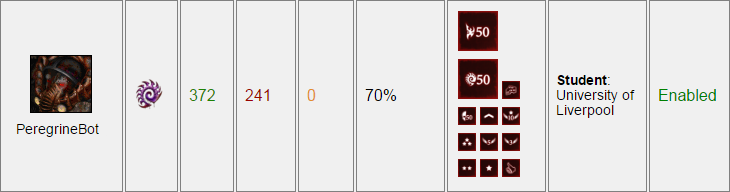

# PeregrineBot
A C++ AI bot that plays the game Starcraft Broodwar using a "Zerg 5-pool" strategy.

*Caption: The scores that PeregrineBot has got against other bots in an online 24/7 league hosted at [SSCAI Tournament](http://sscaitournament.com/index.php?action=scores).*

**Uses: BWAPI & BWTA2 libraries**
